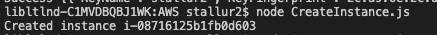
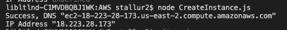

# HW0-DevOps

**Unity Id:** stallur2

**Name:** Sruthi Talluri 

### Basic course setup


Properly setting up your Discord and Moodle profile.
* Moodle


* For Discord


### Github 


### Do class activities

Make an brief introduction of yourself in #welcome


Pick and explain the difference between nightly builds, continuous integration, continuous delivery, and continuous deployment in Breakout.

Discussion: Living with Continuous Deployment.


I joined the us-east-1 channel at 2:00 pm on Tuesday and discussed about the above topics. 

### Do Basics workshop exercises

* [ ] Setup: Practice: Installing useful software


* [ ] Setup: Exercise: Customize your bash prompt

* Customize Bash to show green for correct command **ls** and red for wrong command **foo**:


* Customize Bash to show number of jobs running 


* [ ] Shells: Exercise: Data Science with Bash

Please find the outputs of the questions in Exercise


* [ ] Markdown: Practice: Create an About Me Page (AboutMe.md)

Please find the About Me page in the github repo and its corresponding image:


* [ ] Online Tools: Practice: Set up a Task List and Github Project

Image showing an issue in the Trello Board of Github:


**Bonus:** Git: Complete all levels in https://learngitbranching.js.org/ 


### Opunit checks 

* Acheive 100% pass rate for opunit profile checks:

```sh
opunit profile CSC-DevOps/profile:519.yml
```

Checking my local machine against a course profile, by running the above command:


### Answer conceptual questions

* 1. Explain class philosophy of "Understand how it works"

    Initally the developers and operations were different parts and one did not understand how the other works but it was needed and important to understand how it works to find better solutions. If we do not understand how it works we will not be able to fix the errors or problems and create dependencies everywhere.

* 2. What is heredoc, and why might it be useful?

    When writing shell scripts you may be in a situation where you need to pass a multiline block of text or code to an interactive command, such as tee , cat, or sftp .
    In Bash and other shells like Zsh, a Here document (Heredoc) is a type of redirection that allows you to pass multiple lines of input to a command.

* 3. Explain what does it mean by "Commits are NOT diffs"?

    It is said that Commits are snapshots, not diffs because, it is a snapshot in time. Each Commits contains metadata describing the snapshot such as author and committer (including name, email address, and date) and a commit message. 
    The diff is dynamically generated from the snapshot data by comparing the root trees of the commit and its parent. Git can compare any two snapshots in time.

* 4. What are signs of a bad kanban board?

    A bad kanban board is when all the issues are located in a single like TO-DO and not tracked or moved properly. 
    They are not maintained and assigned to developers etc. 

* 5. Why are nightly builds useful?
    
    Nightly builds are useful to deploy softeares in the off peak hours and when it takes long time to function. It also happens when few users are present. 

* 6. Explain "Every Feature is an Experiment"

    Every feature is an experiment in todays world since a lot of percentage of features develop do not make to the end user. As mentioned in the lectures many companies are following slow to release was where they deploy a feature and only tell their customers after they see how the users are responding to it, hence it is like an experiment. 

* 7. What does it mean by "Comfort the Customer with Discomfort"

   "Comfort the Customer with Discomfort" means to provide the customers with features initally and later remove them if it is not received well, so making every feature an experiment we are first seeing if the cutomer likes it or not, hence we may create a discomfort for the customer only to release the best features for their comfort. 

* 8. Explain "You are the Support Person"

    Working in DevOps we consider ourselves to be the support person too, we have to take responsibility to provide continous support as we have to deliver and deploy contonously unlike old times. We will not have people for testing, then deploying etc..

* 9. Why can sharing an api key be problematic?

    Sharing an api key is problematic because other people ca piggyback on the resources that we have access to, because we will be paying for it most of the time. Also sometimes if the API key authenticates someone for access to a subset of data, then it will give them access to data.

* 10. What differences did you observe between the two cloud provider apis you tried?

    The difference between the two key providers is that in AWS EC2 the rest api create call needed few different parameters and the, but hd multiple options of images. The Digital Ocean had limited set of images. 

### Complete provisioning workshop

Steps in Provision Workshop:

Please find the steps output in the images below. <br> The code and README.md file to describe for the same can be found in the notebook uploaded in the github in Digital Ocean Folder

* 1. List Regions


* 2. List Images


* 3. Create Droplet


* 4. Get Droplet Information


* 5. Ping 


* 6. Delete Droplet


* 7. Ping


### Provision with additional cloud provider

Please find the steps output in the images below. <br> The code and README.md file to describe for the same can be found in the notebook uploaded in the github in AWS Folder

* 1. Create Instance



* 2. Get Instance Information



### Screencast 

* Opunit Checks

    [Opunit Checks Demo](https://drive.google.com/file/d/1bjUq6J4_a4EGDmCkw8iQLxGm2dVY2ILl/view?usp=sharing)

* Digital Ocean  

    [Digital Ocean Demo](https://drive.google.com/file/d/1UrYF-sdN1gePSvWe7_U2lv4ZHVEaEu4H/view?usp=sharing)

* AWS 
    
    [AWS Demo](https://drive.google.com/file/d/1msZ9aAiwYuzhoQ7uNR52-69-kSuoabak/view?usp=sharing)